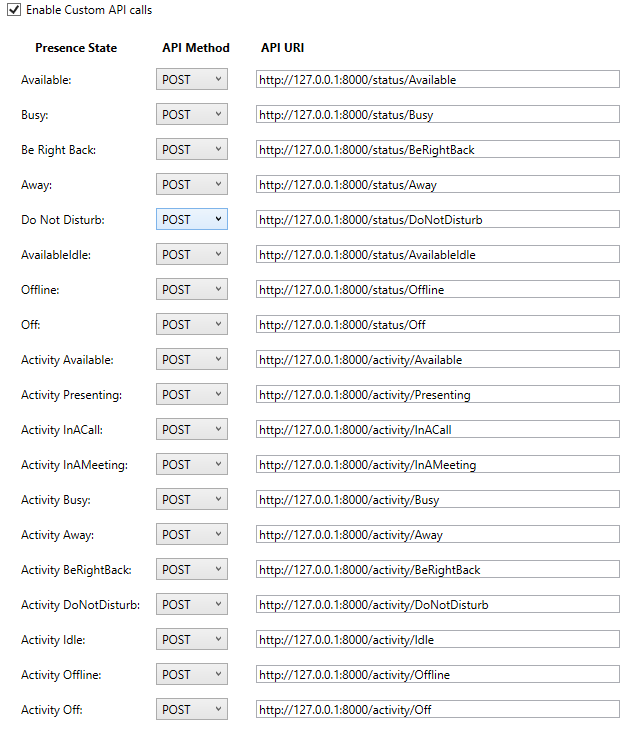

# Presence Light Home Assistant API Bridge

Creates a [FastAPI](https://github.com/tiangolo/fastapi) bridge to [Home Assistant](https://www.home-assistant.io/) for use with the simplified Custom API interface in [Presence Light](https://github.com/isaacrlevin/PresenceLight).

Fork from [https://github.com/loganjohnlong/presence-light-ha-api](https://github.com/loganjohnlong/presence-light-ha-api). Instead of changing the color of a light, this fork just forwards the status and activity to Home Assistant sensor that it creates on the fly.

If you are looking to just turn an Home Assistant entity off or on, please see [https://github.com/jeroenterheerdt/presence-light-ha-api](https://github.com/jeroenterheerdt/presence-light-ha-api).

## How to use

1. Get a [Long-lived Access Token](https://www.atomicha.com/home-assistant-how-to-generate-long-lived-access-token-part-1/) from your Home Assistant installation
2. Set the following environment variables in Docker:
    - HA_IP: The IP Address or FQDN of your Home Assistant installation that the Docker container will be able to access
    - HA_PORT: The port that your Home Assistant installation runs on (Normally, this is `8123`)
    - HA_ENTITY: The entity name of the sensor you want to use in the `sensor..<name>` format. (I use `sensor_teams` in mine.)
      - Must be a sensor or this application will fail.
    - HA_FRIENDLY_NAME: The friendly name you want to use for your sensor in Home Assistant.
    - HA_TOKEN: The long-lived access token you generated earlier
3. Run the Docker container with the command `docker run -d --restart=unless-stopped -e "HA_IP=<your-ip>" -e "HA_PORT=<your-port>" -e "HA_ENTITY=sensor.<name>" -e "HA_FRIENDLY_NAME=<your_friendly_name" -e "HA_TOKEN=<your-token>" --name=presence-status-ha-api jeroenterheerdt/presence-status-ha-api`
4. Set the Custom API values in Presence Light. You should replace the IP and port seen below with the IP and port of this Docker container (not your Home Assistant installation). All calls in this application use POST.

## API Behavior

- `/status/[X]`: Sets the state and status attribute of the entity to X
- `/activity/[Y]`: Sets the activity attribute of the entity to Y
